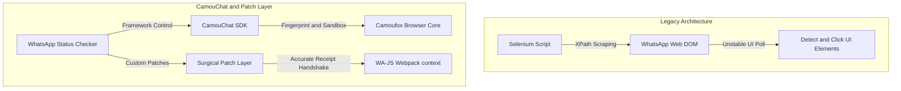

# Legacy(Selenium) to CamouChat-WhatsApp Migration


## Architectural Overview

The legacy application relied on Selenium WebDriver to automate Google Chrome, using complex XPath selectors to navigate the WhatsApp Web DOM. This approach was highly fragile, prone to breaking on minor WhatsApp UI updates, and easily detectable by anti-bot systems.

The migrated system shifts to an **API-driven stealth model** powered by **CamouChat**:
1. **[CamouChat-WhatsApp](https://github.com/CamouChat-Team/CamouChat-WhatsApp)** does the heavy lifting: orchestrating the under-the-hood **Camoufox** browser engine, applying realistic browser fingerprints, and injecting the WA-JS library directly into the WhatsApp Webpack context.
2. Direct API interaction bypasses the DOM entirely, executing native Backbone.js actions on in-memory stores (`StatusV3Store`).
3. We introduced a **custom surgical patch layer** over CamouChat where default behaviors fell short for continuous background monitoring.



---

## Component-Level Comparison

| Feature | Legacy System (Selenium) | Migrated System (CamouChat & Patch Layer) |
| :--- | :--- | :--- |
| **Orchestration SDK** | Custom Selenium wrappers | **CamouChat-WhatsApp** (Direct WhatsApp API) |
| **Automation Driver** | Selenium WebDriver (Chrome) | Hardened Camoufox Firefox engine managed by CamouChat |
| **Data Extraction** | UI/DOM XPath selectors (`//div[...]`) | Native memory queries via `WapiSession` interface |
| **Mark Viewed** | Simulating physical page clicks | Backbone seen receipt stanza transmission |
| **Session Control** | Standard Chrome profile directories | Isolated, platform-bound `ProfileManager` sandbox |
| **Execution Loop** | Synchronous element polling | Non-blocking asynchronous event evaluations |

---

## Technical Milestones & Custom Patches

While **CamouChat-WhatsApp** provided the excellent foundational platform, background status tracking required custom engineering patches to remain resilient and silent:

### 1. Robust Non-Blocking View Receipts
Marking a status as read in WhatsApp Web requires a strict two-way handshake with the server. In headless connections, this handshake frequently hangs or is throttled by the socket, causing standard automation integrations to block indefinitely and eventually timeout.

**Our Patch**:
* **Asynchronous Racing**: Wrapped read receipt execution in a 4-second `Promise.race` wrapper so execution loops never freeze.
* **Timestamp Restructuring**: Fixed a critical design issue where text status updates without a `mediaKeyTimestamp` were silently rejected by WhatsApp servers. The patch extracts the message creation epoch (`msgObj.t`) as a fallback:
  ```javascript
  const timestamp = msgObj.mediaKeyTimestamp || msgObj.t;
  await collection.sendReadStatus(msgObj, timestamp);
  ```
* **Instant State Sync**: Marks status viewed locally instantly, preventing repeat processing while letting the network receipt transmit asynchronously.

### 2. Viewport & Screen Sizing Override
WhatsApp Web dynamically modifies its structural layout if screen resolutions drop below standard bounds. To ensure layout stability while spoofing realistic devices, our patch repairs browser engine sizing to support the custom `.env` dimensions securely.

---

## Migration Phases (Completed)

### ✅ Phase 1: Proof of Concept
- [x] Set up CamouChat-WhatsApp plugin
- [x] Implement single status viewer using internal API
- [x] Basic notification logic

### ✅ Phase 2: Core Features
- [x] Replace all XPath-based operations with wa-js API calls
- [x] Implement notification modes (30m, 1h, 3h, 6h intervals) via `.env`
- [x] Add ProfileManager for session persistence
- [x] Integrate CallMeBot for external notifications

### ✅ Phase 3: Hardening & Cleanup
- [x] Refactor patches for QR Code injection and session management fixes
- [x] Remove all redundant Selenium `vars.py` and old dependencies
- [x] Modularize test suite (`test_realtime.py`, `test_status_processing.py`, `test_health.py`, `test_modes.py`)
- [x] Validate anti-ban measures (humanized delays, proper headers)

---

## Risk Mitigation (Implemented)

### WhatsApp ToS Compliance
- **Mitigation Active**: 
  - Humanized delays (randomized 2-5s between actions)
  - Rate limiting logic embedded in the `whatsapp_operations.py` core
  - Safe, stealth-first viewport configurations

### Technical Risks Handled
- **API changes**: Handled via centralized `patches.py` which dynamically injects fixes to `wa-js` and `camoufox` runtime behavior without waiting for upstream package updates.
- **Profile corruption**: Handled securely via `ProfileManager`.

---

## Success Metrics Achieved
- [x] Zero XPath selectors in codebase
- [x] Headless and Headful modes successfully tested
- [x] Legacy code completely purged from the repository
- [x] Test coverage ensures core polling/notification loop resilience

---

## Credits & Acknowledgments
* **Heavy Lifter**: The bulk of the migration effort and infrastructure support was made possible by **[CamouChat-WhatsApp](https://github.com/CamouChat-Team/CamouChat-WhatsApp)**, a highly robust SDK designed for high-efficiency Webpack hijacking and anti-bot stealth.
* **Hardened Browser Core**: **CamouChat-WhatsApp** uses **[Camoufox](https://github.com/daijro/camoufox)** which provides advanced fingerprint masking and canvas/WebGL spoofing under the hood.
* **API Wrapper**: **[WA-JS (WPPConnect)](https://github.com/wppconnect-team/wa-js)** provides the JavaScript API hooks used to access WhatsApp Web internal stores.
