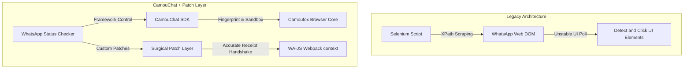

# Legacy(Selenium) to CamouChat-WhatsApp Migration

This document details the architectural migration of the **WhatsApp Status Checker** from its legacy Selenium-based DOM automation to **[CamouChat-WhatsApp](https://github.com/CamouChat-Team/CamouChat-WhatsApp)** — A powerful WhatsApp automation SDK — paired with custom core optimization patches.

---

## Architectural Overview

The legacy application relied on Selenium WebDriver to automate Google Chrome, using complex XPath selectors to scrape the WhatsApp Web DOM. This approach was highly fragile, prone to breaking on minor WhatsApp UI updates, and easily detectable by anti-bot systems.

The migrated system shifts to an **API-driven stealth model** powered by **CamouChat**:
1. **CamouChat-WhatsApp** does the heavy lifting: orchestrating the under-the-hood **Camoufox** browser engine, applying realistic browser fingerprints, and injecting the WA-JS library directly into the WhatsApp Webpack context.
2. Direct API interaction bypasses the DOM entirely, executing native Backbone.js actions on in-memory stores (`StatusV3Store`).
3. We introduced a **custom surgical patch layer** over CamouChat where default behaviors fell short for continuous background monitoring.



---

## Component-Level Comparison

| Feature | Legacy System (Selenium) | Migrated System (CamouChat & Patch Layer) |
| :--- | :--- | :--- |
| **Orchestration SDK** | Custom Selenium wrappers | **[CamouChat-WhatsApp](https://github.com/CamouChat-Team/CamouChat-WhatsApp)** (Direct WhatsApp API) |
| **Automation Driver** | Selenium WebDriver (Chrome) | Hardened Camoufox Firefox engine managed by CamouChat |
| **Data Extraction** | UI/DOM XPath selectors (`//div[...]`) | Native memory queries via `WapiSession` interface |
| **Mark Viewed** | Simulating physical page clicks | Backbone seen receipt stanza transmission |
| **Session Control** | Standard Chrome profile directories | Isolated, platform-bound `ProfileManager` sandbox |
| **Execution Loop** | Synchronous element polling | Non-blocking asynchronous event evaluations |

---

## Technical Milestones & Custom Patches

While **CamouChat-WhatsApp** provided the excellent foundational platform, background status tracking required custom engineering patches to remain resilient and silent:

### 1. Robust Non-Blocking View Receipts
Marking a status as read in WhatsApp Web requires a strict two-way handshake with the server. In headless connections, this handshake frequently hangs or is throttled by the socket, causing standard automation integrations to block indefinitely and eventually timeout.

**Our Patch**:
* **Asynchronous Racing**: Wrapped read receipt execution in a 4-second `Promise.race` wrapper so execution loops never freeze.
* **Timestamp Restructuring**: Fixed a critical design issue where text status updates without a `mediaKeyTimestamp` were silently rejected by WhatsApp servers. The patch extracts the message creation epoch (`msgObj.t`) as a fallback:
  ```javascript
  const timestamp = msgObj.mediaKeyTimestamp || msgObj.t;
  await collection.sendReadStatus(msgObj, timestamp);
  ```
* **Instant State Sync**: Marks status viewed locally instantly, preventing repeat processing while letting the network receipt transmit asynchronously.

### 2. Viewport & Screen Sizing Override
WhatsApp Web dynamically modifies its structural layout if screen resolutions drop below standard bounds. To ensure layout stability while spoofing realistic devices, our patch repairs browser engine sizing to support the custom `.env` dimensions securely.

---

## Credits & Acknowledgments
* **Heavy Lifter**: The bulk of the migration effort and infrastructure support was made possible by **[CamouChat-WhatsApp](https://github.com/CamouChat-Team/CamouChat-WhatsApp)**, a highly robust SDK designed for high-efficiency Webpack hijacking and anti-bot stealth.
* **Hardened Browser Core**: **CamouChat-WhatsApp** uses **[Camoufox](https://github.com/daijro/camoufox)** which provides advanced fingerprint masking and canvas/WebGL spoofing under the hood.
* **API Wrapper**: **[WA-JS (WPPConnect)](https://github.com/wppconnect-team/wa-js)** provides the JavaScript API hooks used to access WhatsApp Web internal stores.
