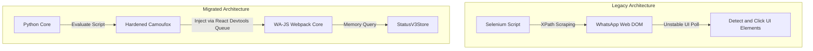

# Selenium to Camoufox/WA-JS Migration Case Study

This document details the architectural migration of the **WhatsApp Status Checker** from legacy Selenium DOM navigation to **Camoufox** (hardened anti-detect browser) and the **WA-JS** internal API.

---

## Architectural Overview

The legacy application relied on Selenium Webdriver to automate Google Chrome, using complex XPath selectors to scrape the WhatsApp Web DOM. This approach was highly fragile, prone to breaking on minor WhatsApp UI updates, and easily detectable by anti-bot systems.

The migrated system shifts to an **API-driven stealth model**:
1. **Camoufox** hosts the session, applying real-time canvas, WebGL, screen, and user-agent spoofing to match authentic human devices.
2. The **Stealth DOM Bridge** injects the WA-JS library directly into the WhatsApp Webpack context, bypassing the DOM entirely.
3. Operations interact directly with in-memory stores (`StatusV3Store`), executing native Backbone.js actions.



---

## Component-Level Comparison

| Feature | Legacy System (Selenium) | Migrated System (Camoufox & WA-JS) |
| :--- | :--- | :--- |
| **Automation Driver** | Selenium WebDriver (Chrome) | Hardened Camoufox (Firefox) with fingerprint spoofing |
| **Data Extraction** | UI/DOM XPath selectors (`//div[...]`) | Native memory queries (`wpp.status.get`) |
| **Mark Viewed** | Simulating physical page clicks | Direct backbone seen receipt stanza transmission |
| **Session Control** | Standard Chrome profile directories | Isolated, platform-bound `ProfileManager` |
| **Execution Loop** | Synchronous element polling | Non-blocking asynchronous event evaluations |

---

## Technical Migration Milestones

### 1. The Stealth DOM Bridge (`_evaluate_stealth`)
To prevent WhatsApp's anti-fraud scripts from scanning the `window` namespace and detecting automation variables (such as `window.WPP`), the bridge implements an annihilation mechanism:
* The WA-JS payload is injected.
* Core API references are cached to hidden local closures.
* `window.WPP` is deleted from the DOM.
* Communication occurs strictly over a private, non-enumerable queue bound to the React Developer Tools handles.

### 2. Smart Status View Receipt Engine
Marking a status as read in WhatsApp Web requires a strict two-way handshake with the server. In standard automations, this handshake frequently hangs or is throttled by headless connections, resulting in a Playwright timeout.

To fix this:
* **Asynchronous Racing**: Wrapped read receipt execution in a 4-second `Promise.race` wrapper.
* **Timestamp Restructuring**: Identified a server-side limitation where text statuses without a `mediaKeyTimestamp` were silently rejected by WhatsApp servers. The engine extracts the message creation epoch (`msgObj.t`) as a fallback:
  ```javascript
  const timestamp = msgObj.mediaKeyTimestamp || msgObj.t;
  await collection.sendReadStatus(msgObj, timestamp);
  ```
* **Instant State Sync**: Marks status viewed locally instantly to prevent repeat processing, while letting the network receipt send complete in the background.

### 3. Screen Viewport Constraints
WhatsApp Web automatically modifies its structural layout if screen resolutions drop below standard bounds. To ensure layout stability while spoofing realistic devices, the configuration enforces a minimum screen boundary of `800x800` inside the spoofed platform profiles.

---

## Effort & Planning Metrics

```
Component Migration        | Story Points (SP)
---------------------------|------------------
Bridge & Engine Injection  | 5 SP
Core Operations Refactor   | 6 SP
Receipt Engine Tuning      | 4 SP
Profile Separation        | 3 SP
Hardening & Anti-Detection | 4 SP
---------------------------|------------------
Total Migration Effort     | 22 SP
```

### Risk Mitigation Strategy
* **Account Action Bans**: Prevented by utilizing humanized randomized delays (2 to 5 seconds) before every status check or read receipt action.
* **IP Range Tracking**: Addressed through built-in support for rotating residential proxies.
