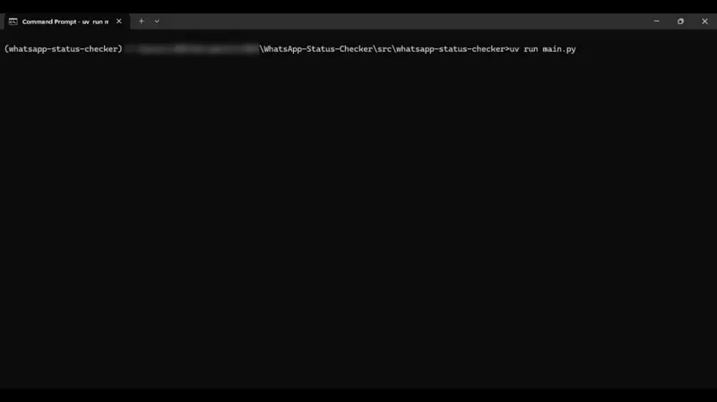

# WhatsApp Status Auto View


WhatsApp Status Checker continuously views a specific contact status as soon as it is uploaded, send you a message about the status type(Image, Video, Text, or  Audio) and the time at which it was viewed OR alternatively always monitor the specific contact status and notify you if a status is uploaded. You get notified every 30minutes, 1hour, 3hours or 6 hours depending on your choice.

> _**NOTE:** WhatsApp does not allow bots or unofficial clients on their platform, so this shouldn't be considered totally safe._

## Demo Video



View HD Demo Video [here](static/videos/Demo.mp4)

## WhatsApp Messenger

[CallMeBot] was used for WhatsApp message, **PLEASE READ!**

# How to use

Make sure your installed Google Chrome Browser is the latest.

  - Create a `.env` file.
    - Set `MY_NUMBER` to your phone number. (Your WhatsApp Number e.g: 234xxxxxxxxxx)
    - Set `CALLMEBOT_APIKEY` to your API Key. (API Key provided by CallMeBot)
      > See [CallMeBot] for detailed information.
    - Set `STATUS_UPLOADER_NAME` contact you want to view their status. 
      > NOTE: As it is saved on your phone(Case Sensitive).
    - **Optionally**, set `TIMEZONE` to your preferred timezone. Time will be displayed in this timezone.
      > If not set, it resolves to IP timezone.
  
  ## Installation
  - <details>
      <summary>Using UV</summary>
      
      - Install UV if you haven't already using `pip install uv`
      - Initialize and create virtual environment using `uv init . && uv venv`
      - Install package using `uv add git+https://github.com/KrAsH-CoD3/WhatsApp-Status-Checker.git`
    </details>
    
  - <details>
      <summary>Using PIP</summary>
      
      - Create a Virtual Environment using `py -m venv .venv`
      - Activate your virtual environment using `.venv\Scripts\activate`
      - Install dependencies using `pip install git+https://github.com/KrAsH-CoD3/WhatsApp-Status-Checker.git`
    </details>
  
  ## Usage
  ```python
  from whatsapp_status_checker import WhatsAppStatusChecker

  def main():
      # Create and run application
      app = WhatsAppStatusChecker()
      app.run()

  if __name__ == "__main__":
      main()
  ```
  </details>


## Screenshots

### Terminal | First Time Logging In

#
### Terminal | Viewed Contact Status 

#
### WhatsApp Message | Status Notification

### See other Screenshots, [Click here](static/images)

## Errors and Fixes

- **Timeout When Logging in:** Increase the timeout value `60` at `wait = WebDriverWait(bot, 60)`.
  > Preferrably, use a more stable internet.
- **Not Receiving WhatsApp Message:** Make sure you follow [CallMeBot] instructions carefully.
  > Also confirm your `.env` values are correct.

## Support and Contribute
- Please []() to encourage developer(s).
- [Fork], do your thing and create a PR.

## Issues and Bug Reports

Found a bug or have a feature request? Please:

1. **Check existing issues**: [Browse issues] to see if it’s already reported.
2. **Open a new issue**: [Create one here] with:
   - A clear title
   - Description (and steps to reproduce, if a bug)
   - Expected vs actual behavior
   - Screenshots or error logs, if relevant
   - Environment (OS, Python, Chrome version)
3. **Use the template**: Please use the provided bug report template.
4. **Feature requests**: Explain what you want, why it’s useful, and any suggestions.


## Discussion

Have feedback or suggestions? Open an [issue] or join [dicussions] on new features, improvements, and use cases. Your input helps shape the project!

## TODO
- [ ] PyPi Package.
    - [x] Convert to a package.
    - [x] pip install package.
    - [ ] publish to PyPi.
- [ ] Automatically
  - [x] Use specified timezone othwerwise automatically get it.
  - [ ] Check first time activity.
    - [ ] Make sure it is completely synced with phone (Loading messages).
  - [x] Handle Chromedriver
    - [x] Check if Chrome browser is updated (same version as latest chromedriver release)
    - [x] Download latest chromedriver.
    - [x] Extract and move to `driver` directory.
  - [x] Handle dedicated Chrome profile 
    - [x] Create a new chrome profile(if not previously done).
    - [x] Use the newly chrome profile(if just created for the first time).
    - [x] Use existing chrome profile(if already created).

[WhatsApp Web]: <https://web.whatsapp.com/>
[Fork]: <https://github.com/KrAsH-CoD3/WhatsApp-Status-Checker/fork/>
[CallMeBot]: <https://www.callmebot.com/blog/free-api-whatsapp-messages/>
[ChromeDriver]: <https://googlechromelabs.github.io/chrome-for-testing/>
[WhatsApp Business Cloud API]: <https://developers.facebook.com/products/whatsapp/>
[WhatsApp Business Cloud API Dashboard]: <README.md#WhatsApp-Business-Cloud-API-Dashboard>
[Create one here]: <https://github.com/KrAsH-CoD3/WhatsApp-Status-Checker/issues/new>
[Browse issues]: <https://github.com/KrAsH-CoD3/WhatsApp-Status-Checker/issues>
[issue]: <https://github.com/KrAsH-CoD3/WhatsApp-Status-Checker/issues>
[REPO]: <https://github.com/KrAsH-CoD3/WhatsApp-Status-Checker>
[Dicussions]: <https://github.com/KrAsH-CoD3/WhatsApp-Status-Checker/discussions>

[Todo]: <README.md#TODO>

